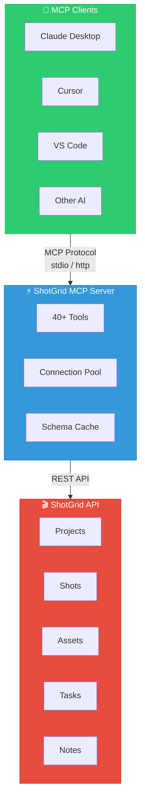

<div align="center">


# ShotGrid MCP Server

**A [Model Context Protocol (MCP)](https://modelcontextprotocol.io) server that provides AI assistants with seamless access to Autodesk ShotGrid (Flow Production Tracking)**

English | [简体中文](README_zh.md)

[](https://pypi.org/project/shotgrid-mcp-server/)
[](https://badge.fury.io/py/shotgrid-mcp-server)
[](LICENSE)
[](https://codecov.io/gh/loonghao/shotgrid-mcp-server)
[](https://pepy.tech/project/shotgrid-mcp-server)
[](https://pepy.tech/project/shotgrid-mcp-server)
[](https://pepy.tech/project/shotgrid-mcp-server)

</div>

## Overview

ShotGrid MCP Server enables AI assistants like Claude, Cursor, and VS Code Copilot to interact directly with your ShotGrid (Flow Production Tracking) data. Built on [FastMCP](https://github.com/jlowin/fastmcp), it provides a high-performance bridge between AI tools and production tracking workflows.

### Demo


## Features

| Category | Highlights |
|----------|------------|
| **40+ Tools** | Complete CRUD operations, batch processing, thumbnails, notes, playlists |
| **Transport** | stdio (local), HTTP (remote), ASGI (production) |
| **Performance** | Connection pooling, schema caching, lazy initialization |
| **Deployment** | FastMCP Cloud, Docker, uvicorn/gunicorn, any ASGI server |
| **Platform** | Windows, macOS, Linux |

## Quick Start

### Installation

```bash
# Using uv (recommended)
uv pip install shotgrid-mcp-server

# Or using pip
pip install shotgrid-mcp-server
```

### Configuration

Set your ShotGrid credentials:

```bash
export SHOTGRID_URL="https://your-site.shotgunstudio.com"
export SHOTGRID_SCRIPT_NAME="your_script_name"
export SHOTGRID_SCRIPT_KEY="your_script_key"
```

### Usage

#### stdio Transport (Default) - For Claude Desktop, Cursor, etc.

```bash
uvx shotgrid-mcp-server
```

#### HTTP Transport - For Remote Access

```bash
uvx shotgrid-mcp-server http --host 0.0.0.0 --port 8000
```

## MCP Client Configuration

Add the server to your MCP client configuration:

### Claude Desktop

```json
{
  "mcpServers": {
    "shotgrid": {
      "command": "uvx",
      "args": ["shotgrid-mcp-server"],
      "env": {
        "SHOTGRID_URL": "https://your-site.shotgunstudio.com",
        "SHOTGRID_SCRIPT_NAME": "your_script_name",
        "SHOTGRID_SCRIPT_KEY": "your_script_key"
      }
    }
  }
}
```

### Cursor / VS Code / Other MCP Clients

```json
{
  "mcpServers": {
    "shotgrid": {
      "command": "uvx",
      "args": ["shotgrid-mcp-server"],
      "env": {
        "SHOTGRID_URL": "https://your-site.shotgunstudio.com",
        "SHOTGRID_SCRIPT_NAME": "your_script_name",
        "SHOTGRID_SCRIPT_KEY": "your_script_key"
      }
    }
  }
}
```

### HTTP Transport (Remote)

```json
{
  "mcpServers": {
    "shotgrid": {
      "url": "http://your-server:8000/mcp",
      "transport": { "type": "http" }
    }
  }
}
```

## Deployment

| Method | Command / Setup |
|--------|-----------------|
| **FastMCP Cloud** | Deploy via [fastmcp.cloud](https://fastmcp.cloud) with `fastmcp_entry.py` |
| **ASGI** | `uvicorn shotgrid_mcp_server.asgi:app --host 0.0.0.0 --port 8000` |
| **Docker** | See [Deployment Guide](docs/deployment.md) |

See the [Deployment Guide](docs/deployment.md) for detailed instructions.

## Available Tools

This server provides **40+ tools** for interacting with ShotGrid:

| Category | Tools |
|----------|-------|
| **CRUD** | `create_entity`, `find_one_entity`, `search_entities`, `update_entity`, `delete_entity` |
| **Batch** | `batch_create`, `batch_update`, `batch_delete` |
| **Media** | `download_thumbnail`, `upload_thumbnail` |
| **Notes** | `shotgrid.note.create`, `shotgrid.note.read`, `shotgrid.note.update` |
| **Playlists** | `create_playlist`, `find_playlists` |
| **Direct API** | `sg.find`, `sg.create`, `sg.update`, `sg.batch`, and more... |

## Example Prompts

Once connected, you can ask your AI assistant:

- *"Find all shots updated last week in Project X"*
- *"Create a playlist with yesterday's lighting renders"*
- *"Add a note to SHOT_010 about the background lighting"*
- *"Summarize time logs for the Animation department this month"*

## Development

```bash
# Clone and install
git clone https://github.com/loonghao/shotgrid-mcp-server.git
cd shotgrid-mcp-server
pip install -r requirements-dev.txt

# Run tests
nox -s tests

# Development server with hot reload
uv run fastmcp dev src/shotgrid_mcp_server/server.py:mcp
```

## Documentation

See the [/docs](docs/) directory for detailed documentation.

## Contributing

Contributions welcome! Please follow the [Google Python Style Guide](https://google.github.io/styleguide/pyguide.html) and write tests.

## License

[MIT](LICENSE)

## Architecture

