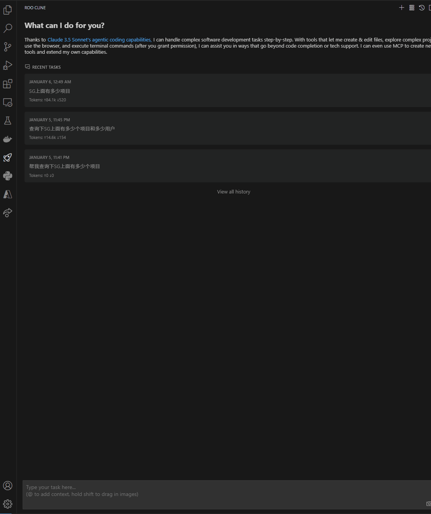

# 🎯 ShotGrid MCP Server

[English](README.md) | 简体中文

<div align="center ">
基于fastmcp的高性能ShotGrid Model Context Protocol (MCP) 服务器实现

[](https://pypi.org/project/shotgrid-mcp-server/)
[](LICENSE)
[](https://badge.fury.io/py/shotgrid-mcp-server)
[](https://codecov.io/gh/loonghao/shotgrid-mcp-server)
[](https://pepy.tech/project/shotgrid-mcp-server)
[](https://pepy.tech/project/shotgrid-mcp-server)
[](https://pepy.tech/project/shotgrid-mcp-server)

</div>

## ✨ 特性

- 🚀 基于fastmcp的高性能实现
- 🛠 完整的CRUD操作工具集
- 🖼 专门的缩略图上传/下载工具
- 🔄 高效的连接池管理
- 🔌 通过MCP工具直接访问ShotGrid API
- 📝 增强的备注和播放列表管理
- ✅ 使用pytest的全面测试覆盖
- 📦 使用UV进行依赖管理
- 🌐 跨平台支持 (Windows, macOS, Linux)

## 🎬 演示

这是使用 ShotGrid MCP 服务器查询实体的简单示例：



## 🚀 快速开始

### 安装

使用UV安装：
```bash
uv pip install shotgrid-mcp-server
```

### 快速使用

安装完成后，您可以直接使用以下命令启动服务器：
```bash
uvx --python 3.10 shotgrid-mcp-server
```

**重要提示**：ShotGrid MCP服务器需要Python 3.10。使用`uvx`时，必须使用`--python 3.10`参数指定Python版本以确保兼容性，因为`uvx`可能默认使用最新的Python版本（例如3.13），而这与本包不兼容。

您也可以通过环境变量设置Python版本：
```bash
# Windows
set UV_PYTHON=3.10
uvx shotgrid-mcp-server

# Linux/macOS
export UV_PYTHON=3.10
uvx shotgrid-mcp-server
```

请确保在启动服务器之前已设置必要的环境变量（SHOTGRID_URL，SHOTGRID_SCRIPT_NAME，SHOTGRID_SCRIPT_KEY）。

### 开发环境设置

1. 克隆仓库：
```bash
git clone https://github.com/loonghao/shotgrid-mcp-server.git
cd shotgrid-mcp-server
```

2. 安装开发依赖：
```bash
pip install -r requirements-dev.txt
```

3. 开发命令
所有开发命令通过nox管理。查看`noxfile.py`获取可用命令：
```bash
# 运行测试
nox -s tests

# 运行代码检查
nox -s lint

# 运行类型检查
nox -s type_check

# 更多命令...
```

4. 开发服务器与热重载

**注意：这需要在您的系统上安装Node.js。**

为了获得更好的开发体验，可以使用热重载功能（代码变更时服务器自动重启）：
```bash
uv run fastmcp dev src/shotgrid_mcp_server/server.py:app
```

这将在开发模式下启动服务器，并且代码的任何变更都会自动重新加载服务器。

## ⚙️ 配置

### 环境变量

以下环境变量是必需的：

```bash
SHOTGRID_URL=your_shotgrid_url
SHOTGRID_SCRIPT_NAME=your_script_name
SHOTGRID_SCRIPT_KEY=your_script_key
```

您可以直接在命令行中设置它们：

```powershell
# PowerShell
$env:SHOTGRID_URL='您的_shotgrid_url'
$env:SHOTGRID_SCRIPT_NAME='您的_script_name'
$env:SHOTGRID_SCRIPT_KEY='您的_script_key'
```

```bash
# Bash
export SHOTGRID_URL='您的_shotgrid_url'
export SHOTGRID_SCRIPT_NAME='您的_script_name'
export SHOTGRID_SCRIPT_KEY='您的_script_key'
```

或者在项目目录中创建一个`.env`文件。

## 🔧 可用工具

### 核心工具
- `create_entity`: 创建ShotGrid实体
- `find_one_entity`: 查找单个实体
- `search_entities`: 使用过滤器搜索实体
- `update_entity`: 更新实体数据
- `delete_entity`: 删除实体

### 媒体工具
- `download_thumbnail`: 下载实体缩略图
- `upload_thumbnail`: 上传实体缩略图

### 备注和播放列表工具
- `shotgrid.note.create`: 创建备注
- `shotgrid.note.read`: 读取备注信息
- `shotgrid.note.update`: 更新备注内容
- `create_playlist`: 创建播放列表
- `find_playlists`: 使用过滤器查找播放列表

### 直接API访问
- `sg.find`: 直接访问ShotGrid API的find方法
- `sg.create`: 直接访问ShotGrid API的create方法
- `sg.update`: 直接访问ShotGrid API的update方法
- `sg.batch`: 直接访问ShotGrid API的batch方法
- 以及更多...

## 🤖 AI提示词示例

以下是一些如何使用ShotGrid MCP与AI助手（如Claude）交互的示例：

### 基本查询

```
帮我查找所有在过去3个月中更新的ShotGrid实体。
```

```
显示“精彩项目”中上周更新的所有镜头。
```

### 创建和管理播放列表

```
创建一个名为“每日审核 - 4月21日”的播放列表，包含所有由灯光部门在昨天更新的镜头。
```

```
查找本周创建的所有播放列表。
```

### 备注和反馈

```
在SHOT_010上添加一条备注，内容为“请调整背景的灯光使其更加戴力化”。
```

### 高级工作流

```
帮我总结本月“动画”部门的时间日志，并使用echarts生成图表来可视化所花费的时间。
```

```
查找灯光团队昨天更新的所有镜头，创建一个名为“灯光审核 - 4月21日”的播放列表，并通过备注通知导演。
```

## 📚 文档

详细的文档请参考`/docs`目录下的文档文件。

您还可以在安装服务器后直接在Claude Desktop中探索可用的工具及其参数。

## 🤝 贡献指南

欢迎提交贡献！请确保：

1. 遵循Google Python代码风格指南
2. 使用pytest编写测试
3. 更新文档
4. 使用绝对导入
5. 遵循项目代码规范

## 📝 版本历史

查看[CHANGELOG.md](CHANGELOG.md)了解详细的版本历史。

## 📄 许可证

MIT许可证 - 查看[LICENSE](LICENSE)文件了解详情。

## 🔌 MCP客户端配置

在MCP客户端中使用ShotGrid MCP服务器时，需要在客户端设置中添加相应的配置。

### Claude Desktop / Anthropic Claude

```json
{
  "mcpServers": {
    "shotgrid-server": {
      "command": "uvx",
      "args": [
        "--python", "3.10",
        "shotgrid-mcp-server"
      ],
      "env": {
        "SHOTGRID_SCRIPT_NAME": "XXX",
        "SHOTGRID_SCRIPT_KEY": "XX",
        "SHOTGRID_URL": "XXXX"
      },
      "disabled": false,
      "alwaysAllow": [
        "search_entities",
        "create_entity",
        "batch_create",
        "find_entity",
        "get_entity_types",
        "update_entity",
        "download_thumbnail",
        "batch_update",
        "delete_entity",
        "batch_delete"
      ]
    }
  }
}
```

### Cursor

```json
// .cursor/mcp.json
{
  "mcpServers": {
    "shotgrid-server": {
      "command": "uvx",
      "args": [
        "--python", "3.10",
        "shotgrid-mcp-server"
      ],
      "env": {
        "SHOTGRID_SCRIPT_NAME": "XXX",
        "SHOTGRID_SCRIPT_KEY": "XX",
        "SHOTGRID_URL": "XXXX"
      }
    }
  }
}
```

### Windsurf (Codeium)

```json
// MCP配置
{
  "mcpServers": {
    "shotgrid-server": {
      "command": "uvx",
      "args": [
        "--python", "3.10",
        "shotgrid-mcp-server"
      ],
      "env": {
        "SHOTGRID_SCRIPT_NAME": "XXX",
        "SHOTGRID_SCRIPT_KEY": "XX",
        "SHOTGRID_URL": "XXXX"
      }
    }
  }
}
```

### Cline (VS Code扩展)

```json
// MCP配置
{
  "mcpServers": {
    "shotgrid-server": {
      "command": "uvx",
      "args": [
        "--python", "3.10",
        "shotgrid-mcp-server"
      ],
      "env": {
        "SHOTGRID_SCRIPT_NAME": "XXX",
        "SHOTGRID_SCRIPT_KEY": "XX",
        "SHOTGRID_URL": "XXXX"
      }
    }
  }
}
```

### Visual Studio Code

```json
// .vscode/mcp.json
{
  "inputs": [
    {
      "type": "promptString",
      "id": "shotgrid-script-name",
      "description": "ShotGrid Script Name",
      "password": false
    },
    {
      "type": "promptString",
      "id": "shotgrid-script-key",
      "description": "ShotGrid Script Key",
      "password": true
    },
    {
      "type": "promptString",
      "id": "shotgrid-url",
      "description": "ShotGrid URL",
      "password": false
    }
  ],
  "servers": {
    "shotgrid-server": {
      "type": "stdio",
      "command": "uvx",
      "args": ["--python", "3.10", "shotgrid-mcp-server"],
      "env": {
        "SHOTGRID_SCRIPT_NAME": "${input:shotgrid-script-name}",
        "SHOTGRID_SCRIPT_KEY": "${input:shotgrid-script-key}",
        "SHOTGRID_URL": "${input:shotgrid-url}"
      }
    }
  }
}
```

### VS Code用户设置

```json
// settings.json
{
  "mcp": {
    "shotgrid-server": {
      "type": "stdio",
      "command": "uvx",
      "args": ["--python", "3.10", "shotgrid-mcp-server"],
      "env": {
        "SHOTGRID_SCRIPT_NAME": "XXX",
        "SHOTGRID_SCRIPT_KEY": "XX",
        "SHOTGRID_URL": "XXXX"
      }
    }
  },
  "chat.mcp.discovery.enabled": true
}
```

### 🔑 凭证设置

在上面的配置示例中，请将以下值替换为您的ShotGrid凭证：
- `SHOTGRID_SCRIPT_NAME`: 您的ShotGrid脚本名称
- `SHOTGRID_SCRIPT_KEY`: 您的ShotGrid脚本密钥
- `SHOTGRID_URL`: 您的ShotGrid服务器URL

### 🛡️ 工具权限

`alwaysAllow`部分列出了可以无需用户确认即可执行的工具。这些工具经过精心选择，确保操作安全。您可以根据安全需求自定义此列表。
