<div align="center">


# ShotGrid MCP Server

**一个 [Model Context Protocol (MCP)](https://modelcontextprotocol.io) 服务器，让 AI 助手能够无缝访问 Autodesk ShotGrid (Flow Production Tracking)**

[English](README.md) | 简体中文

[](https://pypi.org/project/shotgrid-mcp-server/)
[](https://badge.fury.io/py/shotgrid-mcp-server)
[](LICENSE)
[](https://codecov.io/gh/loonghao/shotgrid-mcp-server)
[](https://pepy.tech/project/shotgrid-mcp-server)
[](https://pepy.tech/project/shotgrid-mcp-server)
[](https://pepy.tech/project/shotgrid-mcp-server)

**📖 [Documentation](https://loonghao.github.io/shotgrid-mcp-server/) | [中文文档](https://loonghao.github.io/shotgrid-mcp-server/zh/)**

</div>

## 概述

ShotGrid MCP Server 使 Claude、Cursor、VS Code Copilot 等 AI 助手能够直接与您的 ShotGrid (Flow Production Tracking) 数据交互。基于 [FastMCP](https://github.com/jlowin/fastmcp) 构建，为 AI 工具与制作跟踪工作流之间提供高性能桥梁。

### 演示

#### 0. 代码编辑器配置 ShotGrid MCP


#### 1. 查询任务安排与工作量可视化


**提示词：** `查询近一周的组员任务安排，工作量的负载率每天按照工时8小时来算，用 web 方式可视化显示`

#### 2. 批量创建资产与任务分配


**提示词：** `将上述推荐的阵容的英雄在 shotgrid Demo:Animation 项目上批量创建，归类到角色里面，并使用 FilmVFX-CharacterAsset 任务模版，任务分配给杨卓，任务的起始时间结束时间范围为下周`

#### 3. 统计 TimeLog 数据并可视化


**提示词：** `查询 shotgrid 上的 timelog 数据并以 web 的方式可视化显示出来`

#### 4. 部门效率统计并发送企业微信


**提示词：** `整理出部门的效率，将数据发送到企业微信，部门效率计算公式如下：效率 = 任务 bid / timelog 工时`

#### 使用示例


## 功能特性

| 类别 | 亮点 |
|------|------|
| **40+ 工具** | 完整的 CRUD 操作、批量处理、缩略图、备注、播放列表 |
| **传输方式** | stdio (本地)、HTTP (远程)、ASGI (生产) |
| **性能** | 连接池、Schema 缓存、延迟初始化 |
| **部署** | FastMCP Cloud、Docker、uvicorn/gunicorn、任意 ASGI 服务器 |
| **平台** | Windows、macOS、Linux |

## 快速开始

### 安装

```bash
# 使用 uv（推荐）
uv pip install shotgrid-mcp-server

# 或使用 pip
pip install shotgrid-mcp-server
```

### 配置

设置 ShotGrid 凭证：

```bash
export SHOTGRID_URL="https://your-site.shotgunstudio.com"
export SHOTGRID_SCRIPT_NAME="your_script_name"
export SHOTGRID_SCRIPT_KEY="your_script_key"
```

### 使用

#### stdio 传输（默认）- 用于 Claude Desktop、Cursor 等

```bash
uvx shotgrid-mcp-server
```

#### HTTP 传输 - 用于远程访问

```bash
uvx shotgrid-mcp-server http --host 0.0.0.0 --port 8000
```

## MCP 客户端配置

将服务器添加到您的 MCP 客户端配置：

### Claude Desktop

```json
{
  "mcpServers": {
    "shotgrid": {
      "command": "uvx",
      "args": ["shotgrid-mcp-server"],
      "env": {
        "SHOTGRID_URL": "https://your-site.shotgunstudio.com",
        "SHOTGRID_SCRIPT_NAME": "your_script_name",
        "SHOTGRID_SCRIPT_KEY": "your_script_key"
      }
    }
  }
}
```

### Cursor / VS Code / 其他 MCP 客户端

```json
{
  "mcpServers": {
    "shotgrid": {
      "command": "uvx",
      "args": ["shotgrid-mcp-server"],
      "env": {
        "SHOTGRID_URL": "https://your-site.shotgunstudio.com",
        "SHOTGRID_SCRIPT_NAME": "your_script_name",
        "SHOTGRID_SCRIPT_KEY": "your_script_key"
      }
    }
  }
}
```

### HTTP 传输（远程）

```json
{
  "mcpServers": {
    "shotgrid": {
      "url": "http://your-server:8000/mcp",
      "transport": { "type": "http" }
    }
  }
}
```

## 部署

| 方式 | 命令 / 设置 |
|------|-------------|
| **FastMCP Cloud** | 通过 [fastmcp.cloud](https://fastmcp.cloud) 部署，使用 `fastmcp_entry.py` |
| **ASGI** | `uvicorn shotgrid_mcp_server.asgi:app --host 0.0.0.0 --port 8000` |
| **Docker** | 参见 [部署指南](docs/deployment_zh.md) |

详细说明请参阅 [部署指南](docs/deployment_zh.md)。

## 可用工具

本服务器提供 **40+ 工具** 用于与 ShotGrid 交互：

| 类别 | 工具 |
|------|------|
| **CRUD** | `create_entity`、`find_one_entity`、`search_entities`、`update_entity`、`delete_entity` |
| **批量** | `batch_create`、`batch_update`、`batch_delete` |
| **媒体** | `download_thumbnail`、`upload_thumbnail` |
| **备注** | `shotgrid.note.create`、`shotgrid.note.read`、`shotgrid.note.update` |
| **播放列表** | `create_playlist`、`find_playlists` |
| **直接 API** | `sg.find`、`sg.create`、`sg.update`、`sg.batch` 等... |

## 提示词示例

连接后，您可以这样询问 AI 助手：

- *"查找项目 X 中上周更新的所有镜头"*
- *"创建一个包含昨天灯光渲染的播放列表"*
- *"给 SHOT_010 添加一条关于背景灯光的备注"*
- *"汇总本月动画部门的时间日志"*

## 开发

```bash
# 克隆并安装
git clone https://github.com/loonghao/shotgrid-mcp-server.git
cd shotgrid-mcp-server
pip install -r requirements-dev.txt

# 运行测试
nox -s tests

# 带热重载的开发服务器
uv run fastmcp dev src/shotgrid_mcp_server/server.py:mcp
```

## 文档

详细文档请参阅 [/docs](docs/) 目录。

## 贡献

欢迎贡献！请遵循 [Google Python 代码风格指南](https://google.github.io/styleguide/pyguide.html) 并编写测试。

## 许可证

[MIT](LICENSE)

## 🏗️ 架构

```mermaid
flowchart TB
    subgraph Clients["🤖 MCP 客户端"]
        direction LR
        CLAUDE["Claude Desktop"]
        CURSOR["Cursor"]
        VSCODE["VS Code"]
        AI["其他 AI"]
    end

    subgraph MCP["⚡ ShotGrid MCP Server"]
        direction LR
        TOOLS["40+ 工具"]
        POOL["连接池"]
        SCHEMA["Schema 缓存"]
    end

    subgraph ShotGrid["🎬 ShotGrid API"]
        direction LR
        P["项目"]
        S["镜头"]
        A["资产"]
        T["任务"]
        N["备注"]
    end

    Clients -->|"MCP 协议<br/>stdio / http"| MCP
    MCP -->|"REST API"| ShotGrid

    style Clients fill:#2ecc71,stroke:#27ae60,color:#fff
    style MCP fill:#3498db,stroke:#2980b9,color:#fff
    style ShotGrid fill:#e74c3c,stroke:#c0392b,color:#fff
```


