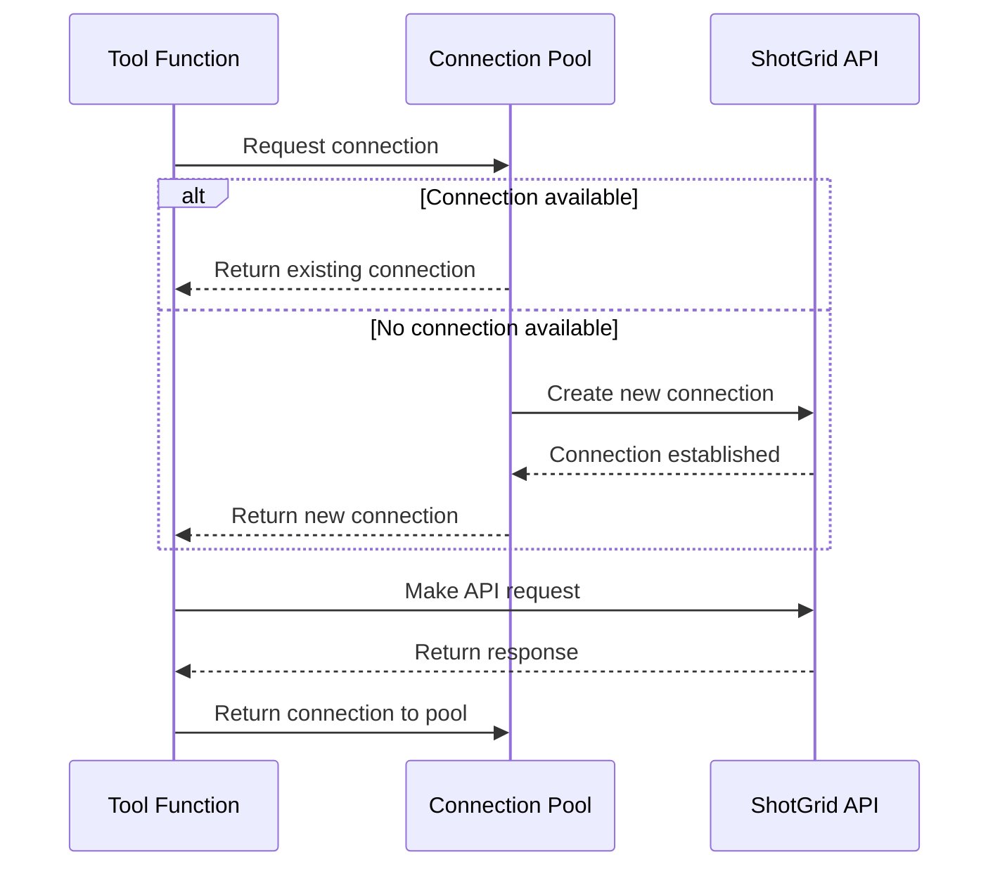

# Connection Pool

The Connection Pool is a key component of ShotGrid MCP Server that efficiently manages connections to the ShotGrid API. It provides connection reuse, error handling, and automatic retries to ensure reliable communication with ShotGrid.

## Why Use a Connection Pool?

ShotGrid API connections are relatively expensive to establish and maintain. The Connection Pool provides several benefits:

1. **Performance**: Reuses existing connections instead of creating new ones for each request.
2. **Reliability**: Handles connection errors and automatically retries failed operations.
3. **Resource Management**: Limits the number of concurrent connections to prevent overwhelming the ShotGrid server.
4. **Monitoring**: Tracks connection usage and performance metrics.

## How It Works

The Connection Pool maintains a pool of ShotGrid API connections that can be borrowed, used, and returned:



## Using the Connection Pool

### Automatic Usage

When you use the `server.connection` property or create tools with the `@server.tool()` decorator, the Connection Pool is used automatically:

```python
@server.tool()
def find_projects(status: str = None):
    """Find projects in ShotGrid."""
    filters = []
    if status:
        filters.append(["sg_status", "is", status])
    
    # This automatically uses a connection from the pool
    return server.connection.find(
        "Project",
        filters,
        ["id", "name", "code", "sg_status"]
    )
```

### Manual Usage

For more control, you can manually acquire and release connections:

```python
@server.tool()
async def complex_operation():
    """Perform a complex operation requiring multiple API calls."""
    results = []
    
    # Manually acquire a connection from the pool
    async with server.connection_pool.connection() as sg:
        # Use the connection for multiple operations
        projects = sg.find("Project", [], ["id", "name"])
        for project in projects:
            shots = sg.find(
                "Shot",
                [["project", "is", {"type": "Project", "id": project["id"]}]],
                ["code"]
            )
            results.append({
                "project": project["name"],
                "shot_count": len(shots)
            })
    
    # Connection is automatically returned to the pool
    return results
```

The `async with` statement ensures the connection is properly returned to the pool, even if an exception occurs.

## Configuration

You can configure the Connection Pool when creating the ShotGrid MCP Server:

```python
from shotgrid_mcp_server import ShotGridMCPServer

server = ShotGridMCPServer(
    name="ShotGrid Assistant",
    shotgrid_url="https://your-site.shotgunstudio.com",
    script_name="your_script_name",
    api_key="your_api_key",
    
    # Connection Pool settings
    max_connections=10,           # Maximum number of connections in the pool
    connection_timeout=30,        # Timeout for ShotGrid API calls (seconds)
    max_retries=3,                # Maximum number of retries for failed operations
    retry_delay=1.0,              # Delay between retries (seconds)
    health_check_interval=60      # Interval for connection health checks (seconds)
)
```

### Configuration Options

| Parameter | Type | Default | Description |
|-----------|------|---------|-------------|
| `max_connections` | int | 10 | Maximum number of connections in the pool |
| `connection_timeout` | int | 30 | Timeout for ShotGrid API calls (seconds) |
| `max_retries` | int | 3 | Maximum number of retries for failed operations |
| `retry_delay` | float | 1.0 | Delay between retries (seconds) |
| `health_check_interval` | int | 60 | Interval for connection health checks (seconds) |

## Advanced Usage

### Connection Context

The Connection Pool provides a context manager for acquiring and releasing connections:

```python
async def process_entity(entity_type, entity_id):
    async with server.connection_pool.connection() as sg:
        # Use the connection
        entity = sg.find_one(entity_type, [["id", "is", entity_id]])
        # Process the entity...
        return entity
```

### Error Handling

The Connection Pool automatically handles many common ShotGrid API errors:

1. **Connection Errors**: If a connection fails, the pool will retry with a different connection.
2. **Timeout Errors**: If a request times out, the pool will retry the operation.
3. **Authentication Errors**: If authentication fails, the pool will attempt to re-authenticate.

For custom error handling, you can catch specific exceptions:

```python
from shotgun_api3.shotgun import ShotgunError

@server.tool()
def update_entity(entity_type, entity_id, data):
    """Update an entity with error handling."""
    try:
        return server.connection.update(entity_type, entity_id, data)
    except ShotgunError as e:
        if "Permission denied" in str(e):
            raise ValueError(f"You don't have permission to update this {entity_type}")
        elif "does not exist" in str(e):
            raise ValueError(f"{entity_type} with ID {entity_id} does not exist")
        else:
            # Re-raise other ShotGrid errors
            raise
```

### Monitoring

The Connection Pool provides methods to monitor its status:

```python
@server.tool()
def get_connection_stats():
    """Get statistics about the connection pool."""
    stats = server.connection_pool.stats()
    return {
        "total_connections": stats["total"],
        "active_connections": stats["active"],
        "idle_connections": stats["idle"],
        "requests_served": stats["requests"],
        "errors_encountered": stats["errors"]
    }
```

## Best Practices

1. **Use Async Context Managers**: When manually acquiring connections, always use the async context manager (`async with`) to ensure proper release.

2. **Batch Operations**: Use ShotGrid's batch API for multiple operations to reduce the number of API calls.

3. **Limit Connection Time**: Don't hold onto connections for long periods. Get what you need and release the connection.

4. **Handle Errors Gracefully**: Catch and handle specific ShotGrid errors to provide better feedback to users.

5. **Monitor Pool Health**: In production, monitor the connection pool statistics to ensure it's functioning properly.

## Next Steps

Now that you understand the Connection Pool, you can:

- Learn about [optimized queries](/patterns/optimized-queries) to make the most of your connections
- Explore [batch operations](/patterns/batch-operations) for efficient data manipulation
- See how to handle [errors](/patterns/error-handling) gracefully
