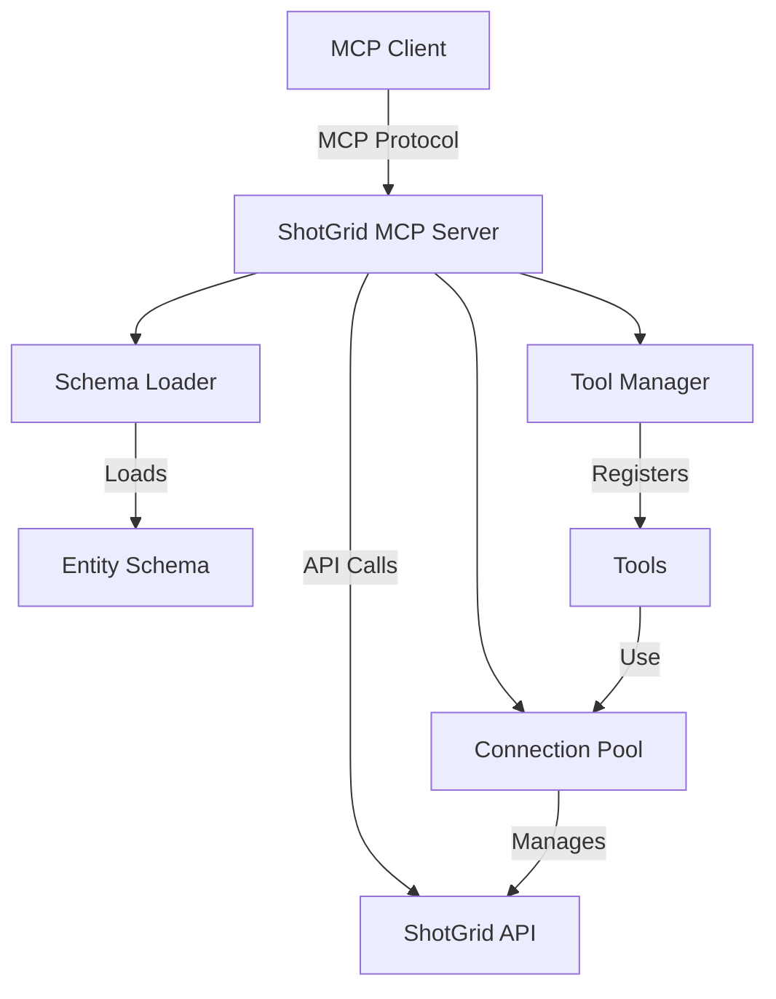

# ShotGrid MCP Server Overview

ShotGrid MCP Server is built on the Model Context Protocol (MCP) and provides a standardized way for LLMs to interact with ShotGrid data. This page provides an overview of the server architecture and key components.

## Architecture

ShotGrid MCP Server consists of several key components:



### Core Components

1. **Server**: The main `ShotGridMCPServer` class that implements the MCP protocol and manages all components.

2. **Connection Pool**: Manages connections to the ShotGrid API, providing efficient connection reuse and error handling.

3. **Schema Loader**: Loads and caches the ShotGrid schema, which defines entity types, fields, and relationships.

4. **Tool Manager**: Registers and manages tools that can be called by MCP clients.

5. **Mockgun Extension**: An enhanced version of ShotGrid's Mockgun for testing without a real ShotGrid instance.

## Server Configuration

When creating a `ShotGridMCPServer` instance, you can configure various aspects of its behavior:

```python
from shotgrid_mcp_server import ShotGridMCPServer

server = ShotGridMCPServer(
    # Server identification
    name="Production Assistant",
    
    # ShotGrid connection (choose one approach)
    shotgrid_url="https://your-site.shotgunstudio.com",
    script_name="your_script_name",
    api_key="your_api_key",
    
    # OR use an existing Shotgun instance
    # shotgun=existing_shotgun_instance,
    
    # OR use Mockgun for testing
    # use_mockgun=True,
    
    # Connection pool settings
    max_connections=10,
    connection_timeout=30,
    
    # Schema settings
    schema_path="path/to/schema.bin",
    entity_schema_path="path/to/entity_schema.bin",
    
    # Behavior settings
    on_duplicate_tools="warn",  # Options: "warn", "error", "replace", "ignore"
)
```

### Configuration Options

| Parameter | Type | Description |
|-----------|------|-------------|
| `name` | str | Name of the server, shown to clients |
| `shotgrid_url` | str | URL of your ShotGrid instance |
| `script_name` | str | Script name for API authentication |
| `api_key` | str | API key for authentication |
| `shotgun` | Shotgun | Existing Shotgun instance to use |
| `use_mockgun` | bool | Whether to use Mockgun instead of real ShotGrid |
| `max_connections` | int | Maximum number of connections in the pool |
| `connection_timeout` | int | Timeout for ShotGrid API calls (seconds) |
| `schema_path` | str | Path to a cached schema file |
| `entity_schema_path` | str | Path to a cached entity schema file |
| `on_duplicate_tools` | str | How to handle duplicate tool registrations |

## Lifecycle Hooks

ShotGrid MCP Server provides hooks for running code at different points in the server lifecycle:

```python
@server.on_startup
async def startup_handler():
    """Run when the server starts."""
    print("Server is starting up!")
    # Initialize resources, load data, etc.

@server.on_shutdown
async def shutdown_handler():
    """Run when the server is shutting down."""
    print("Server is shutting down!")
    # Clean up resources, save state, etc.
```

## Running the Server

To start the server, call the `run` method:

```python
if __name__ == "__main__":
    server.run(
        host="0.0.0.0",  # Listen on all interfaces
        port=8000,       # Port to listen on
        log_level="info" # Logging level
    )
```

For more control over the server lifecycle, you can use the async API:

```python
import asyncio

async def main():
    await server.start()
    try:
        # Keep the server running
        await asyncio.Future()
    finally:
        await server.stop()

if __name__ == "__main__":
    asyncio.run(main())
```

## Next Steps

Now that you understand the server architecture, you can:

- Learn how to create [Tools](/servers/tools) for your server
- Understand the [Connection Pool](/servers/connection-pool) for efficient API usage
- Explore the [Schema Loader](/servers/schema-loader) for working with ShotGrid schemas
- See how to use [Mockgun](/servers/mockgun) for testing
